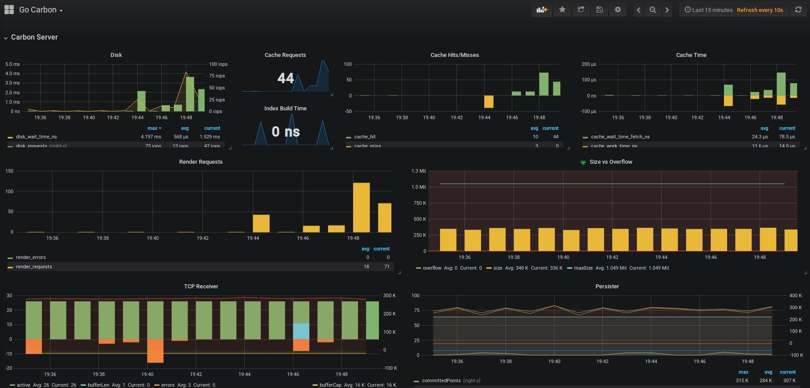
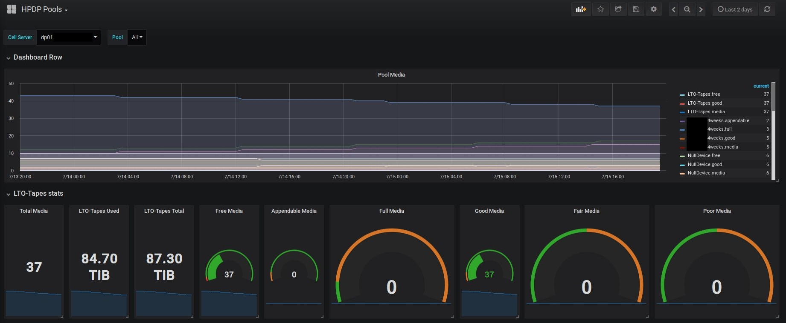
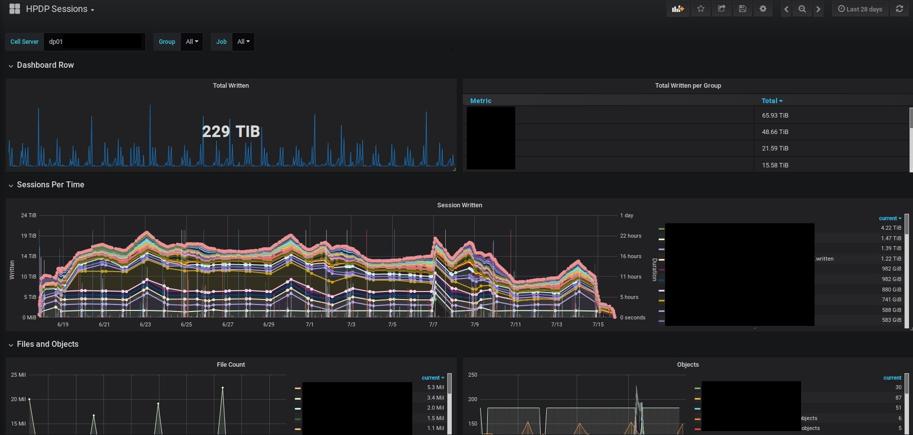
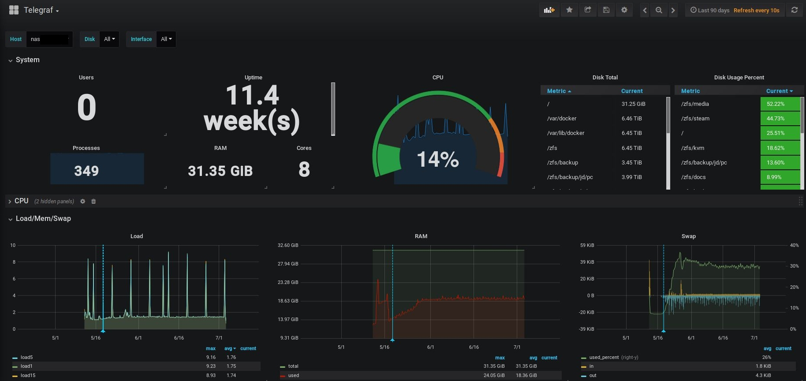
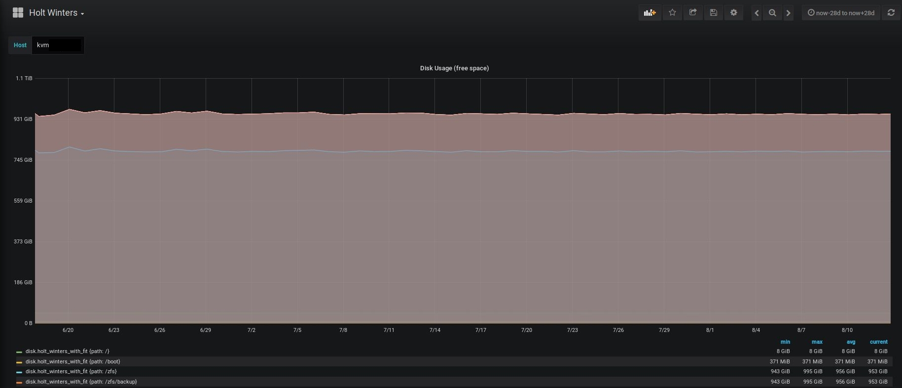
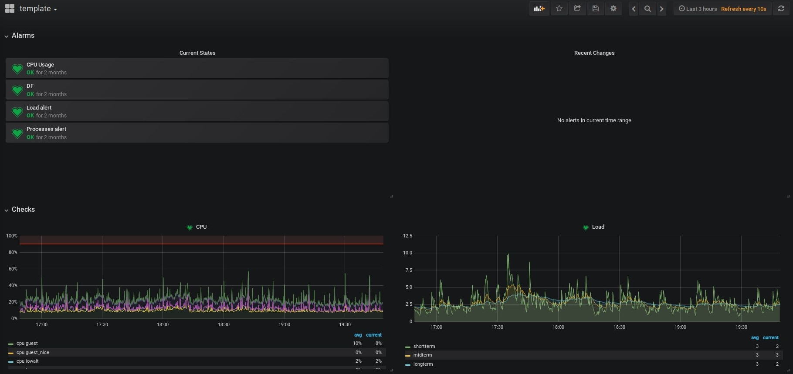
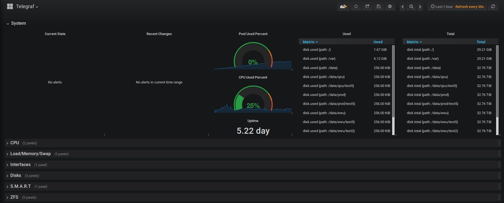
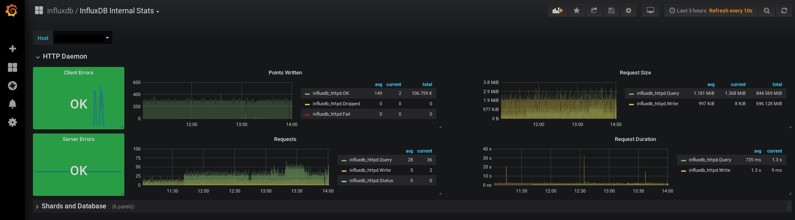
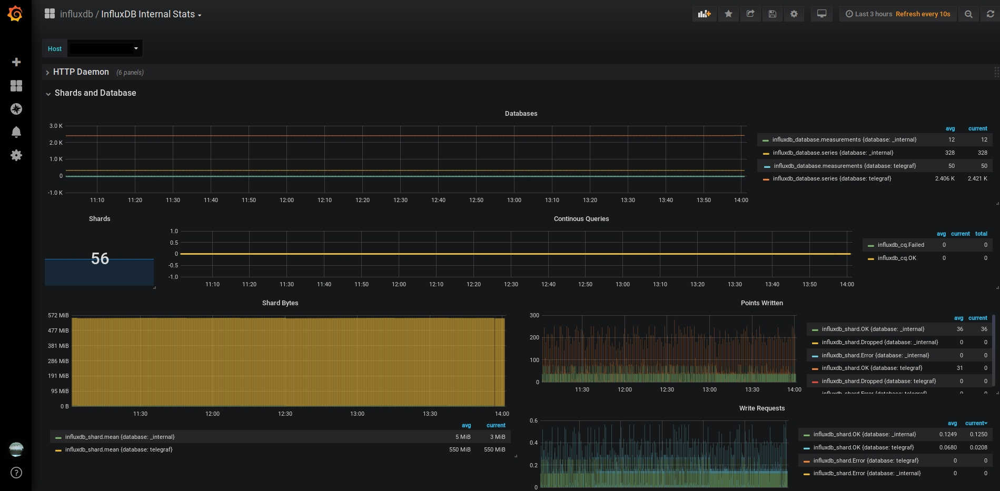

# Dashboards
A set of Grafana dashboards I built over time.

## graphite/collectd.json

## graphite/go_carbon.json

## graphite/hpdp_pools.json

## graphite/hpdp_sessions.json

## graphite/Telegraf.json

## graphite/zfs_on_linux.json

## influxdb/holt_winters.json

## influxdb/monitoring_template.json

## influxdb/Telegraf_no_Templates.json

## influxdb/internal_stats.json

